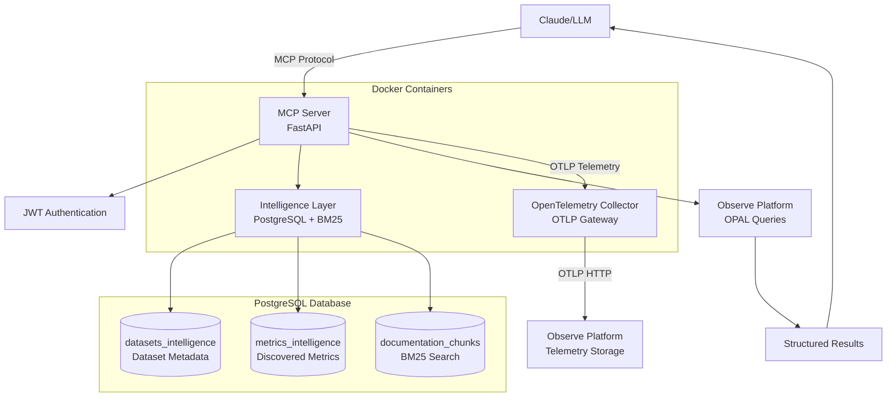

# Observe Community MCP Server


A Model Context Protocol (MCP) server that provides LLMs with intelligent access to [Observe](https://observeinc.com) platform data through semantic search, automated dataset discovery, and metrics intelligence.

## What This Does

This MCP server transforms how LLMs interact with observability data by providing intelligent discovery and search capabilities for the Observe platform. Instead of requiring users to know specific dataset names or metric structures, it enables natural language queries that automatically find relevant data sources and provide contextual analysis.

**Key Features:**
- **Smart Dataset Discovery**: Find relevant datasets using natural language descriptions
- **Metrics Intelligence**: Discover and understand metrics with automated categorization and usage guidance
- **Documentation Search**: Fast BM25-powered search through Observe documentation and OPAL reference
- **OPAL Query Execution**: Run queries against any Observe dataset with multi-dataset join support
- **OpenTelemetry Integration**: Built-in Observe agent for collecting application telemetry data
- **Zero External Dependencies**: Self-contained with PostgreSQL BM25 search

> **⚠️ EXPERIMENTAL**: This is a community-built MCP server for testing and collaboration. A production version is available to Observe customers through official channels.

## Table of Contents

- [Available Tools](#available-tools)
- [Quick Start](#quick-start)
- [Architecture](#architecture)
- [Intelligence Systems](#intelligence-systems)
- [OpenTelemetry Integration](#opentelemetry-integration)
- [Authentication](#authentication)
- [Maintenance](#maintenance)

## Available Tools

The server provides **5 intelligent tools** for Observe platform interaction:

### 🔍 Discovery & Search
- **`discover_datasets`**: Find datasets using natural language queries with intelligent categorization and usage examples
- **`discover_metrics`**: Search through analyzed metrics with business/technical categorization and relevance scoring
- **`get_relevant_docs`**: Search Observe documentation and OPAL language reference using fast PostgreSQL BM25 search

### ⚡ Query Execution
- **`execute_opal_query`**: Run OPAL queries against single or multiple Observe datasets with comprehensive error handling

### 🤖 System Integration
- **`get_system_prompt`**: Retrieve the system prompt that configures LLMs as Observe platform experts

Each tool includes authentication validation, error handling, and structured result formatting optimized for LLM consumption.

## Quick Start

### Prerequisites

- **Docker & Docker Compose** (recommended approach)
- **Python 3.11+** (for manual installation)
- **Observe API credentials** (customer ID and token)

### 1. Clone and Configure

```bash
git clone https://github.com/your-repo/observe-community-mcp.git
cd observe-community-mcp

# Copy and configure environment
cp .env.template .env
# Edit .env with your Observe credentials (see below)
```

### 2. Environment Configuration

Edit your `.env` file with these required values:

```bash
# Observe Platform Access
OBSERVE_CUSTOMER_ID="your_customer_id"
OBSERVE_TOKEN="your_api_token"
OBSERVE_DOMAIN="observeinc.com"

# MCP Authentication (see Authentication section)
PUBLIC_KEY_PEM="-----BEGIN PUBLIC KEY-----
your_public_key_content_here
-----END PUBLIC KEY-----"

# Database Security
SEMANTIC_GRAPH_PASSWORD="your_secure_postgres_password"

# OpenTelemetry Collection (optional)
OBSERVE_OTEL_TOKEN="your_otel_token_here"
OBSERVE_OTEL_CUSTOMER_ID="your_customer_id_here"
OBSERVE_OTEL_DOMAIN="observeinc.com"
```

### 3. Start with Docker (Recommended)

```bash
# Build and start all services
docker-compose up --build

# The server will be available at http://localhost:8000
```

### 4. Initialize Intelligence Systems

Run these commands locally to populate the intelligence databases:

```bash
# Activate virtual environment
source .venv/bin/activate

# Populate documentation search index
python scripts/setup_bm25_docs.py

# Build dataset intelligence (analyzes datasets in your Observe instance)
python scripts/datasets_intelligence.py

# Build metrics intelligence (analyzes metrics with categorization)
python scripts/metrics_intelligence.py
```

### 5. Connect with Claude Desktop

Add to your `claude_desktop_config.json`:

```json
{
  "mcpServers": {
    "observe-community": {
      "command": "npx",
      "args": [
        "mcp-remote@latest",
        "http://localhost:8000/sse",
        "--header", "Authorization: Bearer your_mcp_token_here"
      ]
    }
  }
}
```

## Architecture

The MCP server uses a modern, self-contained architecture built for performance and reliability:

### System Overview



### Core Components

| Component | Technology | Purpose |
|-----------|------------|---------|
| **MCP Server** | FastAPI + MCP Protocol | Tool definitions and request handling |
| **Observe Integration** | Python asyncio + Observe API | Dataset queries and metadata access |
| **Search Engine** | PostgreSQL + ParadeDB BM25 | Fast documentation and content search |
| **Intelligence Systems** | PostgreSQL + Rule-based Analysis | Dataset and metrics discovery with categorization |
| **OpenTelemetry Collector** | OTEL Collector Contrib | Application telemetry collection and forwarding |
| **Authentication** | JWT + RSA signatures | Secure access control |

### Database Schema

**PostgreSQL with Extensions:**
- `pg_search` (ParadeDB BM25) - Fast full-text search
- Standard PostgreSQL - Metadata storage and analysis

**Key Tables:**
- `datasets_intelligence` - Analyzed dataset metadata with categories and usage patterns
- `metrics_intelligence` - Analyzed metrics with business/technical categorization
- `documentation_chunks` - Searchable documentation content with BM25 indexing

## Intelligence Systems

### Dataset Intelligence

Automatically categorizes and analyzes all Observe datasets to enable natural language discovery:

**Categories:**
- **Business**: Application, Infrastructure, Database, User, Security, Network
- **Technical**: Logs, Metrics, Traces, Events, Resources
- **Usage Patterns**: Common query examples, grouping suggestions, typical use cases

**Example Query:** *"Find kubernetes error logs"* → Automatically discovers and ranks Kubernetes log datasets

### Metrics Intelligence

Analyzes metrics from Observe with comprehensive metadata:

**Analysis Includes:**
- **Categorization**: Business domain (Infrastructure/Application/Database) + Technical type (Error/Latency/Performance)
- **Dimensions**: Common grouping fields with cardinality analysis
- **Usage Guidance**: Typical aggregation functions, alerting patterns, troubleshooting approaches
- **Value Analysis**: Data ranges, frequencies, and patterns

**Example Query:** *"CPU memory utilization metrics"* → Returns relevant infrastructure performance metrics with usage guidance

### Documentation Search

Fast BM25 full-text search through:
- Complete OPAL language reference
- Observe platform documentation
- Query examples and troubleshooting guides

**Search Features:**
- Relevance scoring with BM25 algorithm
- Context-aware chunk retrieval
- No external API dependencies

## OpenTelemetry Integration

The MCP server includes built-in OpenTelemetry collection via a standard OpenTelemetry Collector, enabling comprehensive application monitoring and observability.

### OpenTelemetry Collector

The included OpenTelemetry Collector acts as a telemetry gateway that:
- **Receives telemetry data** from instrumented applications via OTLP protocol
- **Forwards data to Observe** using the standard OTLP HTTP exporter with proper authentication
- **Adds resource attributes** for proper service identification and categorization
- **Handles retries and buffering** for reliable data delivery
- **Provides debug output** for development visibility

### Available Endpoints

When the server is running, applications can send telemetry data to:

| Protocol | Endpoint | Usage |
|----------|----------|--------|
| **OTLP gRPC** | `http://otel-collector:4317` | Recommended for production (within Docker network) |
| **OTLP HTTP** | `http://otel-collector:4318` | Alternative for HTTP-based integrations |
| **Health Check** | `http://otel-collector:13133/` | Collector health monitoring |

### Configuration

The OpenTelemetry Collector is configured via `otel-collector-config.yaml` with:

```yaml
# OTLP receivers for application telemetry
receivers:
  otlp:
    protocols:
      grpc:
        endpoint: 0.0.0.0:4317
      http:
        endpoint: 0.0.0.0:4318

# Processors for data enrichment and batching
processors:
  batch:
    send_batch_size: 1024
    timeout: 1s
  resource:
    attributes:
      - key: "deployment.environment"
        value: "development"
        action: upsert

# Exporters to send data to Observe
exporters:
  otlphttp:
    endpoint: "https://${OBSERVE_OTEL_CUSTOMER_ID}.collect.${OBSERVE_OTEL_DOMAIN}/v2/otel"
    headers:
      authorization: "Bearer ${OBSERVE_OTEL_TOKEN}"
  debug:
    verbosity: basic

# Service pipelines for traces, metrics, and logs
service:
  pipelines:
    traces:
      receivers: [otlp]
      processors: [resource, batch]
      exporters: [otlphttp, debug]
    metrics:
      receivers: [otlp]
      processors: [resource, batch]
      exporters: [otlphttp, debug]
    logs:
      receivers: [otlp]
      processors: [resource, batch]
      exporters: [otlphttp, debug]
```

### Instrumentation Example

To instrument your Python code with OpenTelemetry:

```python
from opentelemetry import trace
from opentelemetry.exporter.otlp.proto.grpc.trace_exporter import OTLPSpanExporter
from opentelemetry.sdk.trace import TracerProvider
from opentelemetry.sdk.trace.export import BatchSpanProcessor

# Configure OTLP exporter to send to OpenTelemetry Collector
otlp_exporter = OTLPSpanExporter(
    endpoint="http://otel-collector:4317",  # Within Docker network
    insecure=True
)

# Set up tracing
trace.set_tracer_provider(TracerProvider())
trace.get_tracer_provider().add_span_processor(
    BatchSpanProcessor(otlp_exporter)
)

# Create spans
tracer = trace.get_tracer(__name__)
with tracer.start_as_current_span("operation"):
    # Your application code here
    pass
```

### Data Flow

1. **Application Code** → Generates traces, metrics, logs via OTEL SDK
2. **OpenTelemetry Collector** → Receives OTLP data on ports 4317/4318
3. **Collector Processing** → Adds resource attributes, batches data, provides debug output
4. **OTLP HTTP Export** → Sends data to Observe platform with proper authentication
5. **Observe Platform** → Receives processed telemetry for analysis

The collector automatically handles authentication, retry logic, and reliable data delivery to the Observe platform.

## Authentication

### MCP Server Authentication

The server uses JWT-based authentication to control access:

```bash
# Generate RSA key pair
mkdir _secure
cd _secure
# Make sure _secure is in your gitignore!
openssl genrsa -out private_key.pem 2048
openssl rsa -in private_key.pem -pubout -out public_key.pem

# Add public key to .env file
cat public_key.pem  # Copy to PUBLIC_KEY_PEM

# Generate user tokens
cd ../scripts
./generate_mcp_token.sh 'user@example.com' 'admin,read,write' '4H'
```

On MacOS, you may need to install `jwt-cli`

```sh
brew install jwt-cli
```

### Observe API Access

**Important Security Note**: Once authenticated to the MCP server, users assume the identity and permissions of the Observe API token configured in the environment. Use Observe RBAC to limit the token's permissions appropriately.

## Maintenance

### Update Intelligence Data

```bash
# Activate virtual environment
source .venv/bin/activate

# Refresh dataset intelligence (when new datasets are added)
python scripts/datasets_intelligence.py

# Update metrics intelligence (daily recommended)
python scripts/metrics_intelligence.py

# Rebuild documentation index (when docs change)
python scripts/setup_bm25_docs.py
```

### Monitor Performance

```bash
# Check server logs
docker logs observe-mcp-server

# Check database status
docker exec observe-semantic-graph psql -U semantic_graph -d semantic_graph -c "\dt"

# Check search performance
docker logs observe-mcp-server | grep "docs search"
```

### Troubleshooting

**Common Issues:**

1. **Empty search results**: Run intelligence scripts to populate data
2. **Slow performance**: Check PostgreSQL connection and restart if needed
3. **Authentication failures**: Verify JWT token and public key configuration
4. **Missing datasets**: Confirm Observe API credentials and network access

**Performance Expectations:**

The system is designed for fast response times:
- Dataset discovery: < 2 seconds
- Metrics discovery: < 1 second
- Documentation search: < 500ms
- Intelligence updates: Run when data changes

---

## Development

### Manual Setup

```bash
# Create virtual environment
python3 -m venv .venv
source .venv/bin/activate
pip install -r requirements.txt

# Start containers
docker-compose build
docker-compose up -d

# Initialize intelligence systems
python scripts/setup_bm25_docs.py
python scripts/datasets_intelligence.py
python scripts/metrics_intelligence.py

# Run server
python observe_server.py
```

### Available Scripts

| Script | Purpose | Runtime |
|--------|---------|---------|
| `scripts/setup_bm25_docs.py` | Initialize documentation search index | ~30 seconds |
| `scripts/datasets_intelligence.py` | Analyze and categorize all datasets | ~5-10 minutes |
| `scripts/metrics_intelligence.py` | Analyze and categorize metrics | ~5-10 minutes |
| `scripts/generate_mcp_token.sh` | Generate JWT tokens for authentication | Instant |

### Contributing

This project demonstrates modern approaches to LLM-native observability tooling. Issues, feature requests, and pull requests are welcome.

**Architecture Principles:**
- Self-contained (minimal external dependencies)
- Fast (< 2 second response times)
- Intelligent (automated categorization and discovery)
- Reliable (comprehensive error handling)