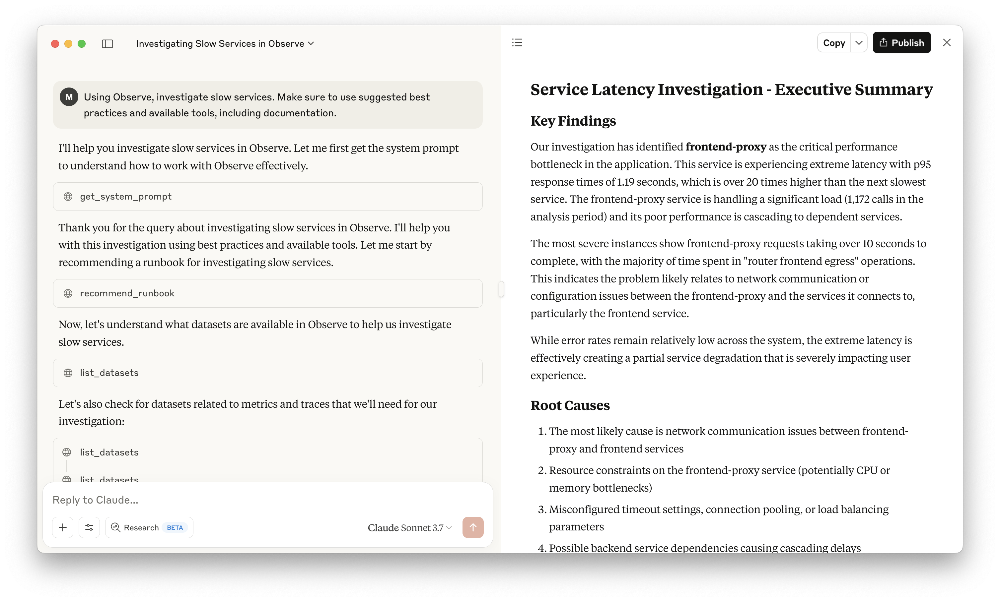
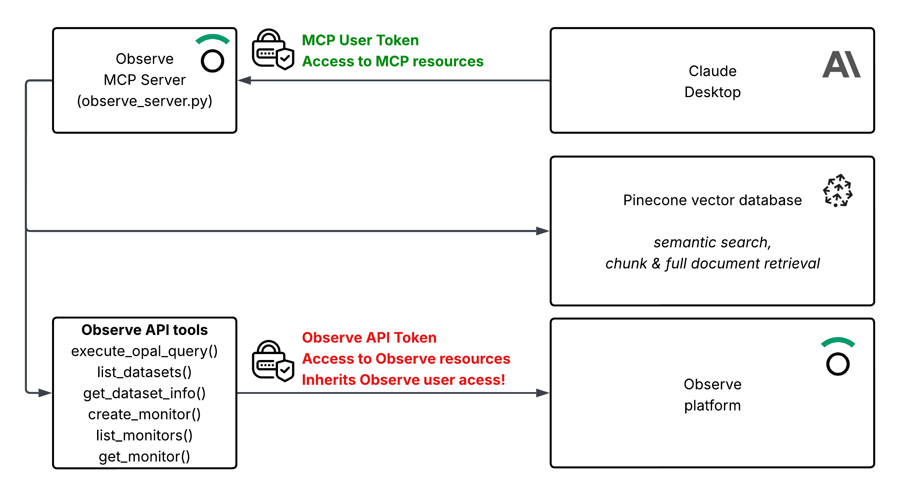
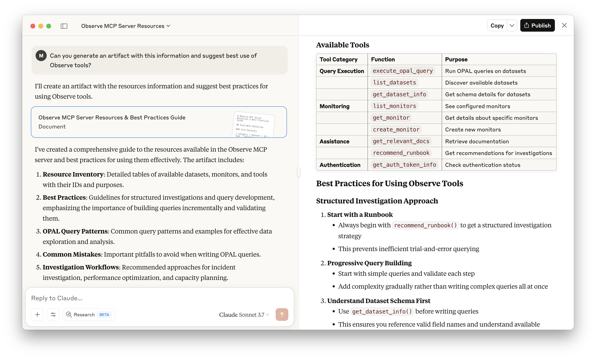

# Observe Community MCP Server


A streamlined Model Context Protocol (MCP) server providing essential access to [Observe](https://observeinc.com) platform functionality through semantic search and dataset intelligence.

## Purpose

This MCP server provides LLMs with direct access to Observe platform data through a curated set of 6 essential tools. It bridges third-party LLMs with your Observe environment while maintaining security and performance.

**Key Benefits:**
- **Dataset Discovery**: Find and understand your Observe datasets with intelligent search
- **OPAL Query Execution**: Execute queries against your observability data
- **Knowledge Integration**: Access OPAL documentation through semantic search
- **Expert Guidance**: Get troubleshooting runbooks and investigation strategies

> **⚠️ DISCLAIMER**: This is an experimental MCP server for testing and collaboration. Use at your own risk. A production-ready version is available to Observe customers.

## Table of Contents

- [Purpose](#purpose)
- [Available MCP Tools](#available-mcp-tools)
- [Quick Start](#quick-start)
  - [Prerequisites](#prerequisites)
  - [Installation](#installation)
  - [Environment Setup](#environment-setup)
  - [Initialize Vector Database](#initialize-vector-database)
- [Running the Server](#running-the-server)
  - [Docker (Recommended)](#docker-recommended)
  - [Manual Python Execution](#manual-python-execution)
- [Authentication Setup](#authentication-setup)
- [Using with Claude Desktop](#using-with-claude-desktop)
- [Architecture Overview](#architecture-overview)
- [Maintenance](#maintenance)

## Available MCP Tools

This MCP server provides 6 core tools for Observe platform access:

### Dataset Intelligence
- **`query_semantic_graph`**: Discover relevant datasets using intelligent semantic search and schema analysis
- **`list_datasets`**: List all available datasets with filtering options
- **`get_dataset_info`**: Get detailed schema information about specific datasets

### Query Execution
- **`execute_opal_query`**: Execute OPAL queries against Observe datasets with comprehensive error handling

### Knowledge & Documentation
- **`get_relevant_docs`**: Search OPAL documentation using semantic vector search
- **`get_system_prompt`**: Get the system prompt that configures LLMs as Observe experts

Each tool includes comprehensive error handling, authentication, and detailed result formatting to ensure reliable LLM integration.



## Quick Start

### Prerequisites

- Python 3.8+
- Docker and Docker Compose (recommended)
- Pinecone account with API key
- Observe API credentials (customer ID and token)

### Installation

```bash
git clone https://github.com/your-repo/observe-community-mcp.git
cd observe-community-mcp
```

### Environment Setup

Copy the example environment file and configure your credentials:

```bash
cp .env.example .env
# Edit .env with your API keys and configuration
```

Required variables:
- `OBSERVE_CUSTOMER_ID`: Your Observe customer ID
- `OBSERVE_TOKEN`: Your Observe API token  
- `OBSERVE_DOMAIN`: Your Observe domain (e.g., observeinc.com)
- `PINECONE_API_KEY`: Your Pinecone API key
- `PUBLIC_KEY_PEM`: Public key for JWT token verification
- `POSTGRES_PASSWORD`: Secure password for the PostgreSQL database

### Initialize Vector Database

Populate the Pinecone indices with documentation and runbooks:

```bash
# Populate documentation index (requires observe-docs directory)
python scripts/populate_docs_index.py

# Populate runbooks index
python scripts/populate_runbooks_index.py
```

> **Note**: If you don't have access to Observe documentation files, contact your Observe representative.

Options for both scripts:
- `--force`: Recreate the index from scratch
- `--verbose`: Enable detailed logging

## Running the Server

### Docker (Recommended)

```bash
# Start with Docker Compose
docker-compose up --build
```

The server will be available at `http://localhost:8000` with automatic health checks and PostgreSQL database.

### Manual Python Execution

For development:

```bash
python3 -m venv .venv
source .venv/bin/activate
pip install -r requirements.txt
python observe_server.py
```

## Architecture Overview

The MCP server uses a clean, modular architecture:

| Component | Purpose |
|-----------|---------|
| `observe_server.py` | Main MCP server with 6 tool definitions |
| `src/observe/` | Observe API integration (queries, datasets, client) |
| `src/dataset_intelligence/` | Semantic dataset discovery with PostgreSQL + pgvector |
| `src/pinecone/` | Vector database operations for documentation search |
| `src/auth/` | JWT authentication and scope-based authorization |
| `scripts/` | Database population scripts |

**Key Features:**
- **Dataset Intelligence**: Semantic search to find relevant datasets
- **OPAL Query Execution**: Direct access to Observe data
- **Documentation Search**: Vector-powered OPAL syntax assistance
- **Authentication**: JWT-based security with scope control
- **PostgreSQL Integration**: Dataset schema caching and semantic search


## Setting up Authentication

> **⚠️ CRITICAL: DO NOT SKIP THIS SECTION. READ IT IN ITS ENTIRETY.**

There are two types of authentication mechanisms used in this server: Observe API authentication and MCP authentication.

**Observe API authentication (Observe API bearer token)** - this inherits the context of the token that is used to authenticate the user who created the token to the Observe platform. This token should be considered secret and is never exposed to the MCP users.

> **⚠️ DANGER ZONE**: The consequence of the above is that once a user is authenticated to the MCP server, they will **NOT** assume their identity in Observe, but the **identity of the user who generated the Observe token**. Make sure to use RBAC and limit access for the Observe API token to specific roles and permissions that you want to make available to the Observe MCP server users.

**MCP authentication (MCP bearer token)** - this is the authentication that is used to authorize the user to access and use the functionality of the MCP server. This token is generated by the server administrator and is exposed to the MCP users, for instance to use in Claude Desktop or other MCP clients.

This second layer of authentication is necessary because the server exposes resource-intensive APIs (like Pinecone) to MCP users. It allows server administrators to control access and prevent resource abuse. 



**IMPORTANT**: Current implementation of the MCP server also includes a basic RBAC via predefined roles: `admin`, `read`, `write`. These **DO NOT** map into any roles in Observe. They are used to control access to the MCP server tools.

**Local-only deployment**: If you're running the server locally without public access, you can disable MCP authentication by modifying `observe_server.py` and removing the `Authorization` header from the MCP client configuration.

## Setting up MCP authentication

Create private and public key files in a secure location, i.e. in `_secure` directory.

```bash
openssl genrsa -out private_key.pem 2048
openssl rsa -in private_key.pem -pubout -out public_key.pem
```

This will create two files:
- `private_key.pem` - the private key file. Keep this secret - you will need it to sign the MCP bearer tokens.
- `public_key.pem` - the public key file. You will need to add this to the `observe_server.py` file.

```bash
cat public_key.pem
```

Copy the public key and add it to the `.env` file:

```bash
# Public PEM key for MCP token verification
PUBLIC_KEY_PEM="-----BEGIN PUBLIC KEY-----
<your_public_key_here>
-----END PUBLIC KEY-----"
```

Sign the bearer token with the private key:

```bash
./generate_mcp_token.sh 'user@example.com' 'admin,read,write' '4H'
```

> **Security Best Practice**: Keep token expiration times short (hours rather than days). Avoid issuing long-lived tokens to minimize security risks.

## Using in Claude Desktop

Add the following to your `claude_desktop_config.json` if you are running the MPC server locally, or provide the URL if you exposed the server publically. 

> **Network Configuration Note**: MCP clients typically restrict HTTP access to localhost only. For internet-accessible deployments, implement an HTTPS reverse proxy (Nginx, Caddy, etc.) with proper DNS configuration and SSL certificates.

```json
{
  "mcpServers": {
    "observe-community": {
      "command": "npx",
      "args": [
        "mcp-remote@latest",
        "http://localhost:8000/sse",
        "--header",
        "Authorization: Bearer bearer_token"
      ]
    }
  }
}
```

The server will be available at `http://localhost:8000` with 6 MCP tools for dataset discovery, query execution, and documentation search.



## Maintenance

To update the vector databases:

```bash
# Update documentation index
python scripts/populate_docs_index.py --force

# Update runbooks index  
python scripts/populate_runbooks_index.py --force
```

Both scripts support `--force` to recreate indices and `--verbose` for detailed logging.
