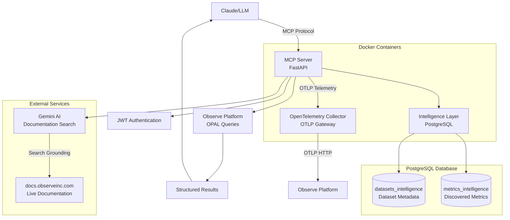

# Observe Community MCP Server


A Model Context Protocol (MCP) server that provides LLMs with intelligent access to [Observe](https://observeinc.com) platform data through semantic search, automated dataset discovery, and metrics intelligence.

> **⚠️ EXPERIMENTAL**: This is a community-built MCP server for testing and collaboration. A production version is available to Observe customers through official channels.

## What This Does

This MCP server transforms how LLMs interact with observability data by providing intelligent discovery and search capabilities for the Observe platform. Instead of requiring users to know specific dataset names or metric structures, it enables natural language queries that automatically find relevant data sources and provide contextual analysis.

**Key Features:**
- **Smart Dataset Discovery**: Find relevant datasets using natural language descriptions
- **Metrics Intelligence**: Discover and understand metrics with automated categorization and usage guidance
- **AI-Powered Documentation Search**: Gemini AI search with real-time access to docs.observeinc.com
- **OPAL Query Execution**: Run queries against any Observe dataset with multi-dataset join support
- **Intelligent Error Enhancement**: Contextual help for query errors with actionable suggestions and documentation links
- **Comprehensive Query Validation**: 69 OPAL verbs, 286 functions, structural validation, and SQL→OPAL translation hints
- **OpenTelemetry Integration**: Built-in Observe agent for collecting application telemetry data
- **Always Current**: Documentation search queries live web content, no local archives needed

## Table of Contents

- [Available Tools](#available-tools)
- [Query Intelligence & Validation](#query-intelligence--validation)
- [Quick Start](#quick-start)
- [Remote Deployment with Nginx](#remote-deployment-with-nginx)
- [Architecture](#architecture)
- [Intelligence Systems](#intelligence-systems)
- [OpenTelemetry Integration](#opentelemetry-integration)
- [Authentication](#authentication)
- [Maintenance](#maintenance)

## Available Tools

The server provides **4 intelligent tools** for Observe platform interaction:

### 🔍 Discovery & Search
- **`discover_datasets`**: Find datasets using natural language queries with intelligent categorization and usage examples
- **`discover_metrics`**: Search through analyzed metrics with business/technical categorization and relevance scoring
- **`get_relevant_docs`**: Search Observe documentation using Gemini AI with real-time web access to docs.observeinc.com

### ⚡ Query Execution
- **`execute_opal_query`**: Run OPAL queries against single or multiple Observe datasets with comprehensive error handling

Each tool includes authentication validation, error handling, and structured result formatting optimized for LLM consumption.

## Query Intelligence & Validation

The server includes comprehensive OPAL query validation and intelligent error enhancement to help users write correct queries faster.

### Query Validation and Error Enhancement

Multi-layer validation catches errors before they reach the API:

- **Structural Validation**: Balanced delimiters, quote matching, complexity limits, nesting depth checks
- **Verb Validation**: All 69 OPAL verbs validated across piped query sequences
- **Function Validation**: 286 OPAL functions with nested and multiple function support
- **Pattern Detection**: Common mistakes like SQL-style sort syntax, m() outside align verb
- **Translation Hints**: SQL→OPAL suggestions for 11 common SQL functions that don't exist in OPAL

### Intelligent Error Enhancement

When queries fail, the system provides contextual help with actionable suggestions. This significantly reduces error recovery for typical OPAL queries by providing immediate, context-aware guidance exactly when users need it.

## Quick Start

### Prerequisites

- **Docker & Docker Compose** (recommended approach)
- **Python 3.13+** (for manual installation)
- **Observe API credentials** (customer ID and token)

### 1. Clone and Configure

```bash
git clone https://github.com/your-repo/observe-community-mcp.git
cd observe-community-mcp

# Copy and configure environment
cp .env.template .env
# Edit .env with your Observe credentials (see below)
```

### 2. Environment Configuration

Edit your `.env` file with these required values:

```bash
# Observe Platform Access
OBSERVE_CUSTOMER_ID="your_customer_id"
OBSERVE_TOKEN="your_api_token"
OBSERVE_DOMAIN="observeinc.com"

# MCP Authentication (see Authentication section)
PUBLIC_KEY_PEM="-----BEGIN PUBLIC KEY-----
your_public_key_content_here
-----END PUBLIC KEY-----"

# Database Security
SEMANTIC_GRAPH_PASSWORD="your_secure_postgres_password"

# Gemini AI for Documentation Search
GEMINI_API_KEY="your_gemini_api_key_here"

# OpenTelemetry Collection (optional)
OBSERVE_OTEL_TOKEN="your_otel_token_here"
OBSERVE_OTEL_CUSTOMER_ID="your_customer_id_here"
OBSERVE_OTEL_DOMAIN="observeinc.com"
```

### 3. Start with Docker (Recommended)

```bash
# Build and start all services
docker-compose up --build

# The server will be available at http://localhost:8000
```

### 4. Initialize Intelligence Systems

Run these commands locally to populate the intelligence databases:

```bash
# Activate virtual environment
source .venv/bin/activate

# Build dataset intelligence (analyzes datasets in your Observe instance)
python scripts/datasets_intelligence.py

# Build metrics intelligence (analyzes metrics with categorization)
python scripts/metrics_intelligence.py
```

**Note**: Documentation search now uses Gemini AI and requires no local setup - it queries docs.observeinc.com in real-time.

### 5. Connect with Claude Desktop

Add to your `claude_desktop_config.json`:

```json
{
  "mcpServers": {
    "observe": {
      "type": "http",
      "url": "http://localhost:8000/mcp",
      "headers": {
        "Authorization": "Bearer your_mcp_token_here"
      }
    }
  }
}
```

## Remote Deployment with Nginx

For production deployments, you can deploy the MCP server behind an nginx reverse proxy with SSL/TLS:

**See [NGINX-README.md](./NGINX-README.md) for complete deployment guide** including:
- SSL certificate setup with Let's Encrypt
- HTTP to HTTPS redirection
- Security headers and best practices
- Client configuration for remote access
- Troubleshooting and maintenance

**Quick deployment:**
```bash
# Stage 1: Get SSL certificates
sudo cp nginx-mcp-bootstrap.conf /etc/nginx/sites-available/your-domain.example.com
sudo ln -s /etc/nginx/sites-available/your-domain.example.com /etc/nginx/sites-enabled/
sudo nginx -t && sudo systemctl reload nginx
sudo certbot certonly --nginx -d your-domain.example.com

# Stage 2: Enable HTTPS
sudo cp nginx-mcp-final.conf /etc/nginx/sites-available/your-domain.example.com
sudo nginx -t && sudo systemctl reload nginx
```

**Remote client configuration:**
```json
{
  "mcpServers": {
    "observe": {
      "type": "http",
      "url": "https://your-domain.example.com/mcp",
      "headers": {
        "Authorization": "Bearer YOUR_JWT_TOKEN"
      }
    }
  }
}
```

## Architecture

The MCP server uses a modern, self-contained architecture built for performance and reliability:

### System Overview



### Core Components

| Component | Technology | Purpose |
|-----------|------------|---------|
| **MCP Server** | FastAPI + MCP Protocol | Tool definitions and request handling |
| **Observe Integration** | Python asyncio + Observe API | Dataset queries and metadata access |
| **Query Validation** | Pattern Matching + Rule Engine | 69 verbs, 286 functions, structural validation |
| **Error Enhancement** | Regex Pattern Matching | Contextual help with actionable suggestions |
| **Documentation Search** | Gemini AI + Google Search | Real-time web search against docs.observeinc.com |
| **Intelligence Systems** | PostgreSQL + Rule-based Analysis | Dataset and metrics discovery with categorization |
| **OpenTelemetry Collector** | OTEL Collector Contrib | Application telemetry collection and forwarding |
| **Authentication** | JWT + RSA signatures | Secure access control |

### Database Schema

**PostgreSQL:**
- Standard PostgreSQL - Metadata storage and analysis

**Key Tables:**
- `datasets_intelligence` - Analyzed dataset metadata with categories and usage patterns
- `metrics_intelligence` - Analyzed metrics with business/technical categorization

**Note**: Documentation search uses Gemini AI and does not require local database storage.

## Intelligence Systems

### Dataset Intelligence

Automatically categorizes and analyzes all Observe datasets to enable natural language discovery:

**Categories:**
- **Business**: Application, Infrastructure, Database, User, Security, Network
- **Technical**: Logs, Metrics, Traces, Events, Resources
- **Usage Patterns**: Common query examples, grouping suggestions, typical use cases

**Example Query:** *"Find kubernetes error logs"* → Automatically discovers and ranks Kubernetes log datasets

### Metrics Intelligence

Analyzes metrics from Observe with comprehensive metadata:

**Analysis Includes:**
- **Categorization**: Business domain (Infrastructure/Application/Database) + Technical type (Error/Latency/Performance)
- **Dimensions**: Common grouping fields with cardinality analysis
- **Usage Guidance**: Typical aggregation functions, alerting patterns, troubleshooting approaches
- **Value Analysis**: Data ranges, frequencies, and patterns

**Example Query:** *"CPU memory utilization metrics"* → Returns relevant infrastructure performance metrics with usage guidance

### Documentation Search

Real-time AI-powered search using Gemini with Google Search grounding:
- Always-current access to docs.observeinc.com
- OPAL language reference and examples
- Platform documentation and troubleshooting guides
- Query examples with contextual explanations

**Search Features:**
- AI-curated results with source citations
- Context-aware documentation retrieval
- Automatic relevance ranking
- Rate-limited to 400 requests/day (Tier 1)

## OpenTelemetry Integration

The MCP server includes built-in OpenTelemetry collection via a standard OpenTelemetry Collector, enabling comprehensive application monitoring and observability.

### OpenTelemetry Collector

The included OpenTelemetry Collector acts as a telemetry gateway that:
- **Receives telemetry data** from instrumented applications via OTLP protocol
- **Forwards data to Observe** using the standard OTLP HTTP exporter with proper authentication
- **Adds resource attributes** for proper service identification and categorization
- **Handles retries and buffering** for reliable data delivery
- **Provides debug output** for development visibility

### Available Endpoints

When the server is running, applications can send telemetry data to:

| Protocol | Endpoint | Usage |
|----------|----------|--------|
| **OTLP gRPC** | `http://otel-collector:4317` | Recommended for production (within Docker network) |
| **OTLP HTTP** | `http://otel-collector:4318` | Alternative for HTTP-based integrations |
| **Health Check** | `http://otel-collector:13133/` | Collector health monitoring |

### Configuration

The OpenTelemetry Collector is configured via `otel-collector-config.yaml` with:

```yaml
# OTLP receivers for application telemetry
receivers:
  otlp:
    protocols:
      grpc:
        endpoint: 0.0.0.0:4317
      http:
        endpoint: 0.0.0.0:4318

# Processors for data enrichment and batching
processors:
  batch:
    send_batch_size: 1024
    timeout: 1s
  resource:
    attributes:
      - key: "deployment.environment"
        value: "development"
        action: upsert

# Exporters to send data to Observe
exporters:
  otlphttp:
    endpoint: "https://${OBSERVE_OTEL_CUSTOMER_ID}.collect.${OBSERVE_OTEL_DOMAIN}/v2/otel"
    headers:
      authorization: "Bearer ${OBSERVE_OTEL_TOKEN}"
  debug:
    verbosity: basic

# Service pipelines for traces, metrics, and logs
service:
  pipelines:
    traces:
      receivers: [otlp]
      processors: [resource, batch]
      exporters: [otlphttp, debug]
    metrics:
      receivers: [otlp]
      processors: [resource, batch]
      exporters: [otlphttp, debug]
    logs:
      receivers: [otlp]
      processors: [resource, batch]
      exporters: [otlphttp, debug]
```

The collector automatically handles authentication, retry logic, and reliable data delivery to the Observe platform.

## Authentication

### MCP Server Authentication

The server uses JWT-based authentication to control access:

```bash
# Generate RSA key pair
mkdir _secure
cd _secure
# Make sure _secure is in your gitignore!
openssl genrsa -out private_key.pem 2048
openssl rsa -in private_key.pem -pubout -out public_key.pem

# Add public key to .env file
cat public_key.pem  # Copy to PUBLIC_KEY_PEM

# Generate user tokens
cd ../scripts
./generate_mcp_token.sh 'user@example.com' 'admin,read,write' '4H'
```

On MacOS, you may need to install `jwt-cli`

```sh
brew install jwt-cli
```

### Observe API Access

**Important Security Note**: Once authenticated to the MCP server, users assume the identity and permissions of the Observe API token configured in the environment. Use Observe RBAC to limit the token's permissions appropriately.

## Maintenance

### Update Intelligence Data

```bash
# Activate virtual environment
source .venv/bin/activate

# Refresh dataset intelligence (when new datasets are added)
python scripts/datasets_intelligence.py

# Update metrics intelligence (daily recommended)
python scripts/metrics_intelligence.py
```

**Note**: Documentation search uses Gemini AI and is always current - no manual updates needed.

### Monitor Performance

```bash
# Check server logs
docker logs observe-mcp-server

# Check database status
docker exec observe-semantic-graph psql -U semantic_graph -d semantic_graph -c "\dt"

# Check Gemini search usage
docker logs observe-mcp-server | grep "gemini"
```

### Troubleshooting

**Common Issues:**

1. **Empty search results**: Run intelligence scripts to populate data
2. **Slow performance**: Check PostgreSQL connection and restart if needed
3. **Authentication failures**: Verify JWT token and public key configuration
4. **Missing datasets**: Confirm Observe API credentials and network access

**Performance Expectations:**

The system is designed for fast response times:
- Dataset discovery: < 2 seconds
- Metrics discovery: < 1 second
- Documentation search: 1-3 seconds (includes AI processing)
- Intelligence updates: Run when data changes

---

## Development

### Manual Setup

```bash
# Create virtual environment
python3 -m venv .venv
source .venv/bin/activate

# Install dependencies (use lock file for reproducible builds)
pip install -r requirements-lock.txt

# Start containers
docker-compose build
docker-compose up -d

# Initialize intelligence systems
python scripts/datasets_intelligence.py
python scripts/metrics_intelligence.py

# Run server
python observe_server.py
```

**Dependency Management:**

This project uses `requirements-lock.txt` for reproducible builds with pinned versions and cryptographic hashes.

- **Installing dependencies**: Always use the lock file for consistent, secure builds:
  ```bash
  pip install -r requirements-lock.txt
  ```

- **Updating dependencies**: When you need to update to newer versions:
  ```bash
  # 1. Install latest compatible versions from requirements.txt
  pip install -r requirements.txt --upgrade

  # 2. Test that everything works
  python observe_server.py  # or run your tests

  # 3. Regenerate lock file with new versions
  pip install pip-tools
  pip-compile requirements.txt --output-file=requirements-lock.txt --generate-hashes --resolver=backtracking

  # 4. Commit both files
  git add requirements.txt requirements-lock.txt
  git commit -m "chore: update dependencies"
  ```

- **Why use lock files?**
  - **Security**: SHA256 hashes prevent package tampering
  - **Reproducibility**: Same lock file = identical builds everywhere
  - **Stability**: Prevents unexpected breaking changes from automatic updates

### Available Scripts

| Script | Purpose | Runtime |
|--------|---------|---------|
| `scripts/datasets_intelligence.py` | Analyze and categorize all datasets | ~5-10 minutes |
| `scripts/metrics_intelligence.py` | Analyze and categorize metrics | ~5-10 minutes |
| `scripts/generate_mcp_token.sh` | Generate JWT tokens for authentication | Instant |

### Contributing

This project demonstrates modern approaches to LLM-native observability tooling. Issues, feature requests, and pull requests are welcome.

**Architecture Principles:**
- Self-contained (minimal external dependencies)
- Fast (< 2 second response times)
- Intelligent (automated categorization and discovery)
- Reliable (comprehensive error handling and validation)
- Secure (input validation, DoS prevention, comprehensive query validation)
- User-friendly (contextual error messages with actionable guidance)