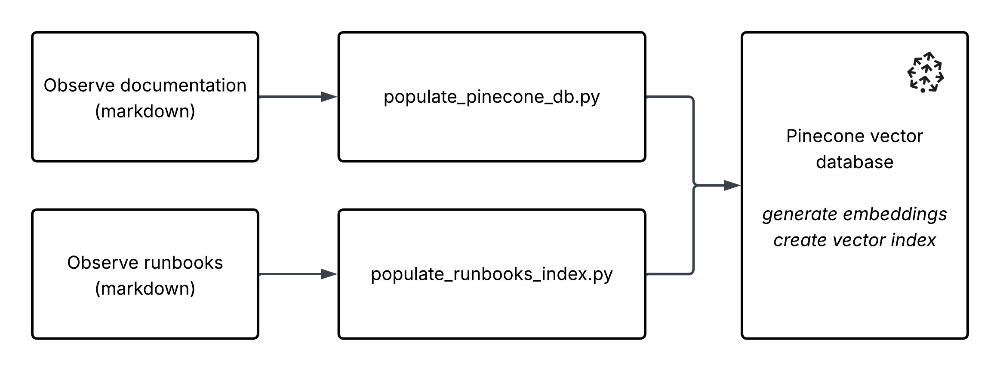
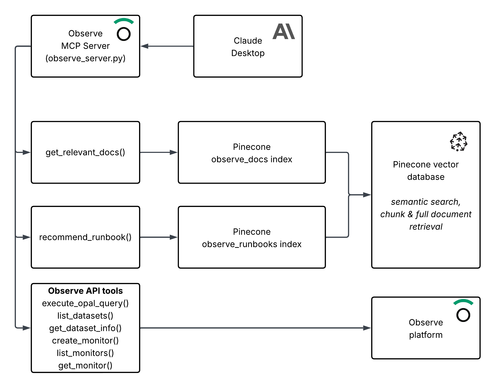
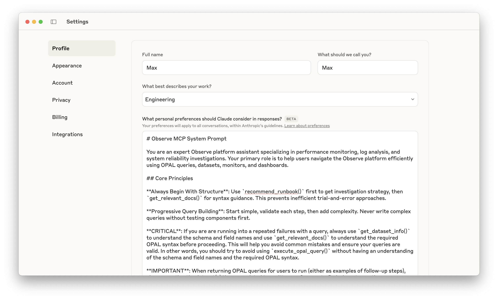

# Observe Community MCP Server

A Model Context Protocol (MCP) server providing access to [Observe](https://observeinc.com) API functionality, OPAL query assistance, and troubleshooting runbooks through vector search.

## Purpose

This server is designed to work with technically capable LLM models, specifically tested with Claude Sonnet 3.7 and Claude Sonnet 4. Unlike traditional chatbots, this MCP server:

- Interfaces directly with the Observe platform in an LLM-friendly way
- Avoids using LLMs for internal functions to prevent private data leakage
- Serves as a secure bridge between third-party LLMs and your Observe data

> **⚠️ IMPORTANT DISCLAIMER**: This is an experimental and unsupported MCP server created for testing and collaboration with Observe AI design partners. Observe bears no liability for any use of this server and does not support it in any way. A separate production-ready MCP server is under development by Observe.

## Overview

This MCP server enables seamless interaction with the Observe platform through:

- Executing OPAL queries
- Exporting worksheet data with flexible time parameters
- Listing and retrieving dataset information
- Providing assistance with OPAL query crafting
- Managing monitors (listing and creation)

The server leverages Pinecone as a vector database for semantic search across:
- OPAL reference documentation
- Troubleshooting runbooks

Despite its experimental nature, the server delivers significant value by enabling:

- Comprehensive troubleshooting using multiple data types (logs, metrics, traces)
- Integration with contextual data (GitHub commits, business metrics, customer journeys)
- Access to vectorized documentation and specialized runbooks for in-depth information on OPAL queries, Observe concepts, and best practices


## Modular Architecture

The server uses a clean, modular architecture for maintainability and reusability. Core functionality is organized into specialized packages, keeping the main server file focused and lean.

### Package Structure

```
src/
├── observe/          # Observe API integration package
│   ├── __init__.py   # Clean API exports
│   ├── client.py     # HTTP client with error handling
│   ├── config.py     # Configuration and environment management
│   ├── datasets.py   # Dataset listing and information
│   ├── queries.py    # OPAL query execution
│   ├── monitors.py   # Monitor creation and management
│   └── worksheets.py # Worksheet export functionality
└── auth/             # Authentication and authorization package
    ├── __init__.py   # Clean API exports
    ├── jwt_utils.py  # JWT token utilities
    ├── scopes.py     # Scope-based authorization middleware
    ├── permissions.py # Permission management
    └── middleware.py # FastMCP authentication integration
```

## Key Components

| Component | Description |
|-----------|-------------|
| `observe_server.py` | Main MCP server implementation with tool definitions |
| **Observe API Package** | |
| `src/observe/` | Organized package containing all Observe API operations |
| `src/observe/client.py` | HTTP client with error handling and request utilities |
| `src/observe/config.py` | Configuration management and environment validation |
| `src/observe/datasets.py` | Dataset listing, filtering, and information retrieval |
| `src/observe/queries.py` | OPAL query execution with QueryBuilder helper |
| `src/observe/monitors.py` | Monitor creation, listing, and management |
| `src/observe/worksheets.py` | Worksheet export with WorksheetExporter class |
| **Authentication Package** | |
| `src/auth/` | Complete authentication and authorization system |
| `src/auth/jwt_utils.py` | JWT token decoding, validation, and utilities |
| `src/auth/scopes.py` | Scope-based authorization middleware with decorators |
| `src/auth/permissions.py` | Permission management and user capability checking |
| `src/auth/middleware.py` | FastMCP authentication integration and setup |
| **Vector Database Package** | |
| `src/pinecone/` | Organized package containing all Pinecone vector database operations |
| `src/pinecone/client.py` | Pinecone client initialization and connection management |
| `src/pinecone/embeddings.py` | Embedding generation for single texts and batches |
| `src/pinecone/search.py` | Semantic search operations for docs and runbooks |
| `src/pinecone/indexing.py` | Document and runbook indexing operations |
| **Scripts and Data** | |
| `populate_docs_index.py` | Simplified script to ingest markdown files from `observe-docs` into Pinecone |
| `populate_runbooks_index.py` | Simplified script to ingest troubleshooting runbooks from `runbooks` into Pinecone |
| `runbooks/` | Directory containing troubleshooting runbooks |
| `observe-docs/` | Directory containing Observe documentation markdown files (not included in public repo) |
| `generate_mcp_token.sh` | Script to generate MCP tokens |

### Architecture Benefits

- **Maintainability**: Each module has a single responsibility and clear boundaries
- **Reusability**: Core logic can be easily imported and used in other projects
- **Type Safety**: Comprehensive TypedDict definitions and type hints throughout
- **Error Handling**: Standardized error patterns with both dictionary and exception-based approaches
- **Testing**: Individual modules can be tested in isolation
- **Documentation**: Each module is self-documenting with comprehensive docstrings

### Key Features

- **Helper Classes**: `QueryBuilder`, `WorksheetExporter`, and `PermissionChecker` for improved developer experience
- **Standardized Error Handling**: Both dictionary-based and exception-based error patterns
- **Complete Authentication**: JWT utilities, scope-based authorization, and permission management
- **Configuration Management**: Centralized environment validation and header sanitization
- **Type Safety**: Comprehensive type definitions and Optional type handling

## Getting Started

### Prerequisites

- Python 3.8+
- Pinecone account with an API key
- Observe API credentials

### Installation

First, clone the repository:

```bash
git clone https://github.com/rustomax/observe-experimental-mcp.git
cd observe-experimental-mcp
```

Create a virtual environment and activate it:

```bash
python3 -m venv .venv
source .venv/bin/activate
```

Install the required dependencies:

```bash
pip install -r requirements.txt
```

### Environment Setup

Copy `.env.template` to `.env` and fill in the values.

### Populating Vector Database

> **Note**: Pinecone's vector indices are *eventually consistent* - after populating an index, allow a few minutes for lookups to return the most recent data.

#### Documentation Index

The vector database needs to be populated with OPAL reference data before the server can provide semantic search capabilities. 

> **IMPORTANT**: if you are not an Observe employee, you won't have access to documentation markdown files. Please contact your Observe representative for assistance for this step.

Run the following command to populate the documentation database:

```bash
python populate_docs_index.py
```

> **Note**: If you have previously created the index and you want a clean slate, you can use the `--force` flag to recreate the index.

This will process all the markdown files in the `observe-docs` directory and create vector embeddings for semantic search. The script will:

- Read markdown files from the `observe-docs` directory (both documentation and prompts)
- Extract metadata and content from these files
- Generate embeddings for each document using Pinecone's integrated embedding model (llama-text-embed-v2)
- Store the embeddings and metadata in the Pinecone index

Options:
- `--force`: Force recreation of the index even if it already exists
- `--verbose`: Enable detailed logging
- `--limit <n>`: Limit the number of files to process (0 for no limit)

The script will show a progress bar as it processes the files and uploads them to Pinecone.

#### Runbooks Index

To populate the runbooks vector database, run:

```bash
python populate_runbooks_index.py
```

> **Note**: If you have previously created the index and you want a clean slate, you can use the `--force` flag to recreate the index.

This script will:

- Find all markdown (.md) files in the `runbooks` directory
- Chunk the content into semantically meaningful segments (approximately 1000 characters each)
- Generate embeddings for each chunk using Pinecone's integrated embedding model
- Store the embeddings and metadata in a separate Pinecone index for runbooks

Options:
- `--force`: Force recreation of the index even if it already exists
- `--runbooks_dir <path>`: Specify a custom path to the runbooks directory

The chunking process preserves the semantic meaning of the content while optimizing for vector search, but the `recommend_runbook` function will return complete runbooks, not just chunks.


Example run:

```bash
python ./populate_runbooks_index.py --force

Forcing recreation of index
Deleting existing index: observe-runbooks
Initializing Pinecone client
Creating new Pinecone index with integrated embedding model: observe-runbooks
Waiting for index to be ready...
Connected to Pinecone index: observe-runbooks
Found 11 runbook files
Processing files: 100%|███████████████████████████| 11/11 [00:00<00:00, 5327.02it/s]
Collected 116 chunks from 11 files
Upserting batch 1/2 with 95 records
Successfully upserted batch 1/2
Upserting batch 2/2 with 21 records
Successfully upserted batch 2/2
Total chunks added to Pinecone: 116
```

## Running the Server

```bash
python observe_server.py
```

The server runs with Server-Sent Events (SSE) transport by default on port 8000. You can modify the port and transport method in the `observe_server.py` file if needed.

## Available MCP Tools

### Observe API Tools
- `execute_opal_query`: Execute an OPAL query on a dataset
- `export_worksheet`: Export data from an Observe worksheet with flexible time parameters (defaults to 15m interval)
- `list_datasets`: List available datasets in Observe
- `get_dataset_info`: Get detailed information about a dataset
- `create_monitor`: Create a new monitor in Observe
- `list_monitors`: List all monitors in Observe
- `get_monitor`: Get detailed information about a specific monitor

### Documentation and Assistance Tools
- `get_relevant_docs`: Get relevant documentation for a query using Pinecone vector search

### Troubleshooting Tools
- `recommend_runbook`: Analyze a user query and recommend the most relevant troubleshooting runbook

### Authentication and System Tools
- `get_system_prompt`: Get the system prompt for the Observe MCP server
- `decode_jwt_token`: Decode a JWT token and return its contents (debugging tool)
- `get_auth_token_info`: Get comprehensive authentication and authorization information
- `admin_system_info`: Get detailed system information (requires admin scope)
- `public_server_info`: Get basic public server information (available to all users)

### Scope-Based Access Control

All tools are protected by scope-based authorization:
- **Admin scope** (`admin`): Full access to all tools including system information
- **Write scope** (`write`): Can create monitors and execute queries 
- **Read scope** (`read`): Can view datasets, monitors, and execute read-only operations

Scopes follow a hierarchical model where `admin` includes `write` and `read` permissions, and `write` includes `read` permissions.

## Worksheet Export Tool

The `export_worksheet` tool provides flexible worksheet data export functionality with multiple time parameter options:

### Parameters

- **`worksheet_id`** (required): The ID of the worksheet to export
- **`time_range`** (optional): Time range for the export (e.g., "15m", "1h", "24h"). Defaults to "15m" if no time parameters are provided
- **`start_time`** (optional): Start time in ISO format (e.g., "2025-07-21T00:00:00Z")
- **`end_time`** (optional): End time in ISO format (e.g., "2025-07-22T00:00:00Z")

### Time Parameter Combinations

The tool supports all standard Observe API time parameter patterns:

1. **Interval only** (relative to now): `export_worksheet("42566610", time_range="1h")`
2. **Start and end times**: `export_worksheet("42566610", start_time="2025-07-21T00:00:00Z", end_time="2025-07-22T00:00:00Z")`
3. **Start time + interval**: `export_worksheet("42566610", start_time="2025-07-21T00:00:00Z", time_range="24h")`
4. **End time + interval**: `export_worksheet("42566610", end_time="2025-07-22T00:00:00Z", time_range="24h")`

### Response Format

The tool returns data in NDJSON (newline-delimited JSON) format. For large datasets, responses are automatically truncated with a summary showing the first 50 lines and total row count.

## Vector Database Helpers

The organized `src/pinecone/` package provides comprehensive Pinecone functionality:

**Core Modules:**
- `src/pinecone/client.py` - Initialize Pinecone client with support for multiple index types
- `src/pinecone/embeddings.py` - Generate embeddings for single texts and batches
- `src/pinecone/search.py` - Semantic search operations for both docs and runbooks  
- `src/pinecone/indexing.py` - Document and runbook indexing with portable path handling

**Key Functions:**
- `initialize_pinecone(index_type)` - Initialize client for specific index type ("docs" or "runbooks")
- `get_embedding(pc, text, is_query)` - Get embedding using Pinecone's integrated embedding model
- `semantic_search(query, n_results, index_type)` - Unified semantic search across index types
- `index_documents(docs_dir)` - Index documents with relative path conversion
- `index_runbooks(runbooks_dir)` - Index runbooks with consistent chunking strategy

## Helper Classes and Utilities

The modular architecture includes several helper classes that improve developer experience and code maintainability:

### Observe API Helpers

**`QueryBuilder`** (`src/observe/queries.py`)
```python
# Build complex OPAL queries programmatically
builder = QueryBuilder()
query = builder.filter("service_name", "cartservice") \
              .filter("status_code", ">=", 400) \
              .timechart("5m", "count()") \
              .build()
```

**`WorksheetExporter`** (`src/observe/worksheets.py`)
```python
# Export worksheets with flexible time parameters
exporter = WorksheetExporter()
data = await exporter.export_with_time_range("42566610", "24h")
data = await exporter.export_with_time_window("42566610", start="2025-01-01T00:00:00Z", end="2025-01-02T00:00:00Z")
```

### Authentication Helpers

**`PermissionChecker`** (`src/auth/permissions.py`)
```python
# Check user permissions programmatically
checker = PermissionChecker(user_scopes=["read", "write"])
if checker.can_create_monitors():
    # User can create monitors
if checker.can_access_admin_tools():
    # User has admin access
```

**`ScopeValidator`** (`src/auth/scopes.py`)
```python
# Validate scopes for complex scenarios
validator = ScopeValidator(required_scopes=["admin", "write"])
result = validator.validate(user_scopes)
if not result["has_access"]:
    return validator.get_access_error()
```

### Error Handling

The modules provide both dictionary-based and exception-based error handling patterns:

```python
# Dictionary-based errors (for MCP tools)
{"error": True, "message": "Access denied"}

# Exception-based errors (for internal logic)  
try:
    result = await some_operation()
except ObserveAPIError as e:
    return {"error": True, "message": str(e)}
```

## Architecture and How It Works

The system uses a multi-index vector database architecture to provide both documentation assistance and runbook recommendations. There are two main workflows: the indexing process and the runtime query process.

### Indexing Process

This diagram shows how documentation and runbooks are processed and loaded into the Pinecone vector database:



### Runtime Query Process

This diagram shows how user queries are processed at runtime:



### Documentation Assistance Flow

1. The LLM assistant calls the MCP server with a user query for documentation
2. The `get_relevant_docs` function is called to process the query
3. The system generates an embedding for the query using Pinecone's inference API
4. This embedding is used to search the "observe-docs" index for relevant document chunks
5. The system groups chunks by source document and calculates relevance scores
6. Complete documents are retrieved from the filesystem and returned, ranked by relevance

### Runbook Recommendation Flow

1. The LLM assistant calls the MCP server with a user troubleshooting query
2. The `recommend_runbook` function is called to process the query
3. The system generates an embedding for the query using Pinecone's inference API
4. This embedding is used to search the "observe-runbooks" index for relevant runbook chunks
5. The system groups chunks by source runbook and calculates average relevance scores
6. The most relevant complete runbook is retrieved from the filesystem and returned to the user

## Advantages of the Vector Database Approach

- **Semantic Understanding**: Vector search understands the meaning of queries, not just keywords
- **Fuzzy Matching**: Can find relevant results even with typos or different wording
- **Relevance Ranking**: Results are ranked by semantic similarity
- **Extensibility**: Easy to add new documents without schema changes
- **Direct Use of Markdown**: Uses markdown files as the source of truth
- **Integrated Embeddings**: Uses Pinecone's built-in embedding model, eliminating the need for OpenAI API keys
- **Scalability**: Pinecone provides a managed, scalable vector database service
- **Chunking with Full Document Retrieval**: Optimizes search accuracy through chunking while providing complete context through full document retrieval


## Setting up Authentication

> **⚠️ CRITICAL: DO NOT SKIP THIS SECTION. READ IT IN ITS ENTIRETY.**

There are two types of authentication mechanisms used in this server: Observe API authentication and MCP authentication.

**Observe API authentication (Observe API bearer token)** - this inherits the context of the token that is used to authenticate the user who created the token to the Observe platform. This token should be considered secret and is never exposed to the MCP users.

> **⚠️ DANGER ZONE**: The consequence of the above is that once a user is authenticated to the MCP server, they will **NOT** assume their identity in Observe, but the **identity of the user who generated the Observe token**. Make sure to use RBAC and limit access for the Observe API token to specific roles and permissions that you want to make available to the Observe MCP server users.

**MCP authentication (MCP bearer token)** - this is the authentication that is used to authorize the user to access and use the functionality of the MCP server. This token is generated by the server administrator and is exposed to the MCP users, for instance to use in Claude Desktop or other MCP clients.

This second layer of authentication is necessary because the server exposes resource-intensive APIs (like Pinecone) to MCP users. It allows server administrators to control access and prevent resource abuse. 


**IMPORTANT**: Current implementation of the MCP server also includes a basic RBAC via predefined roles: `admin`, `read`, `write`. These **DO NOT** map into any roles in Observe. They are used to control access to the MCP server tools.

**Local-only deployment**: If you're running the server locally without public access, you can disable MCP authentication by modifying `observe_server.py` and removing the `Authorization` header from the MCP client configuration.

## Setting up MCP authentication

Create private and public key files in a secure location, i.e. in `_secure` directory.

```bash
openssl genrsa -out private_key.pem 2048
openssl rsa -in private_key.pem -pubout -out public_key.pem
```

This will create two files:
- `private_key.pem` - the private key file. Keep this secret - you will need it to sign the MCP bearer tokens.
- `public_key.pem` - the public key file. You will need to add this to the `observe_server.py` file.

```bash
cat public_key.pem
```

Copy the public key and add it to the `.env` file:

```bash
# Public PEM key for MCP token verification
PUBLIC_KEY_PEM="-----BEGIN PUBLIC KEY-----
<your_public_key_here>
-----END PUBLIC KEY-----"
```

Sign the bearer token with the private key:

```bash
./generate_mcp_token.sh 'user@example.com' 'admin,read,write' '4H'
```

> **Security Best Practice**: Keep token expiration times short (hours rather than days). Avoid issuing long-lived tokens to minimize security risks.

## Using in Claude Desktop

Add the following to your `claude_desktop_config.json` if you are running the MPC server locally, or provide the URL if you exposed the server publically. 

> **Network Configuration Note**: MCP clients typically restrict HTTP access to localhost only. For internet-accessible deployments, implement an HTTPS reverse proxy (Nginx, Caddy, etc.) with proper DNS configuration and SSL certificates.

```json
{
  "mcpServers": {
    "observe-epic": {
      "command": "npx",
      "args": [
        "mcp-remote@latest",
        "http://localhost:8000/sse",
        "--header",
        "Authorization: Bearer bearer_token"
      ]
    }
  }
}
```

The server runs on port 8000 by default. You can modify the port in the `observe_server.py` file if needed.

> **Performance Note**: The server uses Server-Sent Events (SSE) transport by default, streaming responses as they're generated for improved efficiency with large payloads. Transport method can be modified in `observe_server.py` if needed.

Example Startup:

```bash
mcp run ./observe_server.py

Starting observe_server.py
Python version: 3.13.5 (main, Jun 11 2025, 15:36:57) [Clang 15.0.0 (clang-1500.1.0.2.5)]
Python path: ...
Basic imports successful
Attempting to import pinecone module...
Pinecone import successful. Version: 7.0.2
Attempting to import src.pinecone modules...
Successfully imported search functions from src.pinecone.search

Python MCP server starting...
[07/22/25 08:50:22] INFO     Starting MCP server 'observe-epic'   server.py:1297
                             with transport 'sse' on                            
                             http://0.0.0.0:8000/sse/                                   

INFO:     Started server process [67344]
INFO:     Waiting for application startup.
INFO:     Application startup complete.
INFO:     Uvicorn running on http://0.0.0.0:8000 (Press CTRL+C to quit)
```

Test it out in Claude Desktop or any other MCP client, by checking out tools available in Observe MCP server.


## Making the Most of the MCP Server

### Use a Smart Client LLM

By contrast with the Observe's official MCP server, the current project doesn't use LLMs under the hood. This is a current design choice and may or may not change in the future. Instead it assumes the client LLM will provide necessary intelligence to use the available tools most effectively. The Observe MCP server is designed to work with technically capable LLM models. It has been specifically tested with Claude Sonnet 3.7 and Claude Sonnet 4.

### Understand the Ideal Flow of Events

Generally speaking, there is a predefined way for the LLM to use the current MCP server. Understanding this desired flow can help you to better inform the LLM to get the most out of Observe.

1. The MCP client (i.e. Claude Desktop or any other LLM) connects to the MCP server
2. The MCP client discovers available tools and their descriptions
3. The MCP server attempts to convince the model to use a predefined system prompt to configure itself as an Observe expert
4. The LLM parses the query and decides which path to follow.
   * For simple questions related to Observe functionality (i.e. `Create tutorial on OPAL window functions`, the LLM will leverage `get_relevant_docs` tool repeatedly to do semantic lookups in the Pinecone vector database to understand and generate a response)
   * For more complex troubleshooting and investigative  (i.e. `Find root cause of high CPU usage on production servers` or `Investigate slow queries in the database`), it will first ask the MCP server for a relevant runbook recommendation (also semantically searched in the runbooks vector database index) and then use the runbook to guide its investigative process.
5. It will use other tools to craft and run Observe queries, retrieve dataset lists and information, list and create monitors. If it struggles, it will try to lookup relevant documentation to guide itself.

### Hard-Code the System Prompt

As mentioned earlier, when the MCP client first connects to the MCP server it will discover available tools and their descriptions and the MCP server will try to convince the model to use system prompt in `prompts/Observe MCP System Prompt.md` to configure itself as an Observe expert. In situations where the model fails to do so, it might need more calls to accomplish the requested tasks. To ensure the most consistent use of the MCP server, hardcode the system prompt into your LLM configuration, do not rely on the MCP server to configure the model. Here is an example of how to do it in Claude Desktop:



### Craft Effective Prompts

Prompt engineering still applies! You can speed up the investigations by crafting effective prompts, by including clear objectives for the investigation, specifying time ranges of interest to focus the analysis, identifying relevant datasets or systems that should be examined and defining the expected output format, such as requesting a summary with the top 3 issues.

You can also use progressive disclosure to help the LLM build a mental model of your environment. Start with high-level questions and progressively dive deeper based on findings. As you progress through investigation, provide feedback. When the LLM makes incorrect assumptions or uses tools ineffectively, nudge it in the right direction to guide it back on track.

### Use Runbooks to Guide LLMs

Feel free to create, update or delete runbooks as you see fit. Tweak them to your particular environment or use-cases. For instance, if you created a number of custom datasets that are unique to your environment, create a custom runbook that helps LLM use them in investigations. Use LLMs to improve your runbooks by using `Improve this prompt` type of prompt.

### Remind LLMs to Use Tools

Due to sheer volume of tokens pushed into LLM's context window for the investigative process, the LLM can become "forgetful" and stop using available tools effectively. For instance, it might repeatedly struggle to craft a working OPAL query. You can nudge it in the right direction by reminding it to use `get_dataset_info` tool, which returns a list of fields and their types, as well as `get_relevant_docs` tool, which performs semantic search across the documentation and returns relevant chunks. Using these tools in combination dramatically improves the LLM's ability to craft working OPAL queries.

## Maintenance

### Updating Documentation

To update the vector database with new documentation:
1. Add or update markdown files in the `observe-docs` directory
2. Run `python populate_docs_index.py --force` to rebuild the index

### Updating Runbooks

To update the runbooks vector database:
1. Add or update markdown files in the `runbooks` directory
2. Run `python populate_runbooks_index.py --force` to rebuild the index

Both populate scripts now use the organized `src/pinecone/` modules for consistent functionality and maintenance.
