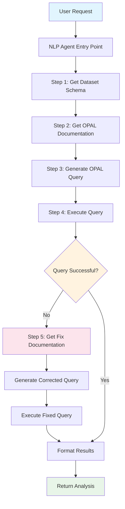
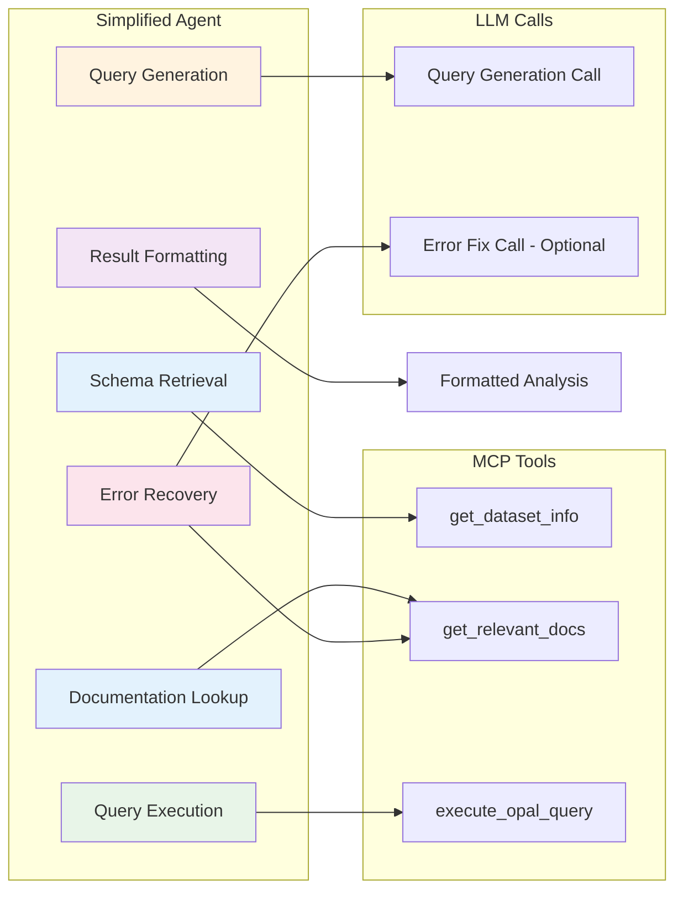
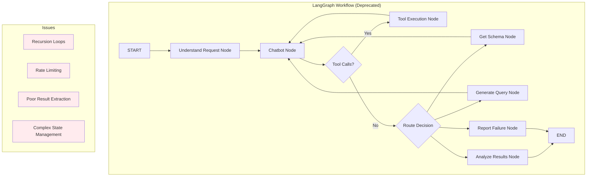
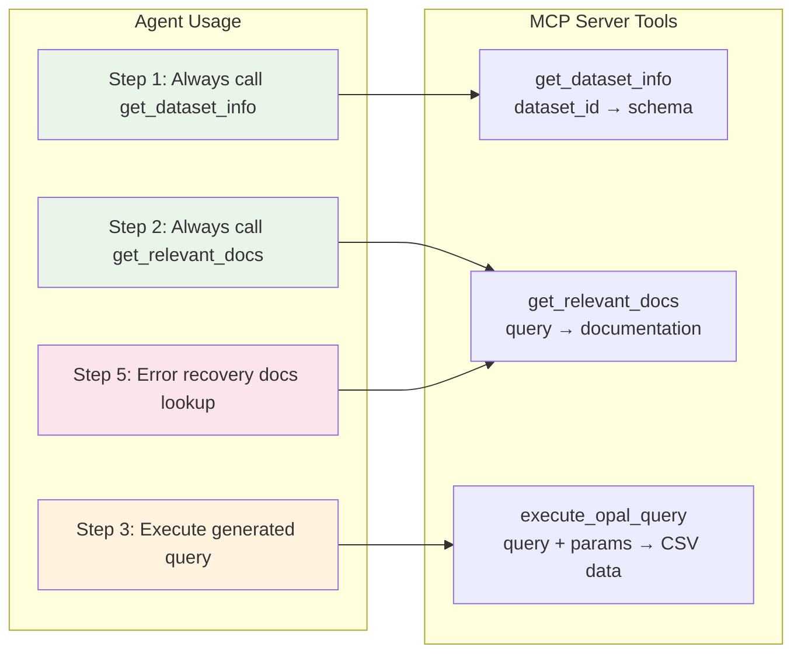

# LangGraph NLP Agent Architecture

## Overview

This document describes the LangGraph-powered Natural Language Processing agent for converting user requests into OPAL queries against Observe datasets. The agent was designed to address critical issues with previous implementations including hallucination, rate limiting, and poor result extraction.

## Problem Statement

### Previous Implementation Issues

1. **Hallucination**: Agent fabricated service names and data instead of using real Observe data
2. **Rate Limiting**: Excessive LLM API calls (50+ requests/minute) hitting Anthropic limits
3. **Poor Result Extraction**: Agent retrieved real data but returned wrong outputs ("36 characters")
4. **Missing Documentation Usage**: Agent ignored `get_relevant_docs` tool despite instructions
5. **Infinite Loops**: Complex conditional routing caused recursion limit errors

### Requirements

- Convert natural language requests to valid OPAL queries
- Use only real data from Observe datasets
- Prevent hallucination through systematic tool usage
- Stay within API rate limits (50 requests/minute)
- Return actual query results with proper analysis

## Architecture Overview

The agent uses a **simplified, sequential approach** rather than complex conversational workflows to ensure reliability and efficiency.



## Current Implementation: Simplified Sequential Agent

**Status**: ✅ **FIXED AND VALIDATED** - Agent now generates proper OPAL syntax and prevents hallucination.

**Key Fixes Applied**:
1. **Corrected Search Query**: Changed from complex function-specific search to basic syntax search (`"OPAL basic syntax examples filter statsby timechart"`)
2. **Enhanced LLM Prompt**: Added explicit prohibition of hallucinated verbs with examples of correct OPAL syntax
3. **Systematic Tool Usage**: Enforced mandatory schema and documentation lookup before query generation

**Validation Results**: Agent now generates `statsby count:count(1), group_by(service_name)` instead of hallucinated `make_set service_name`.

### Architecture Diagram



### Sequential Workflow

1. **Schema Retrieval** (`get_dataset_info`)
   - Fetches dataset schema and field information
   - Provides context for valid field names
   - Prevents field name hallucination

2. **Documentation Lookup** (`get_relevant_docs`)
   - Searches for relevant OPAL syntax patterns
   - Provides examples for query construction
   - Mandatory step to ensure proper syntax

3. **Query Generation** (Single LLM Call)
   - Combines schema + documentation + user request
   - Generates focused OPAL query
   - Uses comprehensive but focused prompt

4. **Query Execution** (`execute_opal_query`)
   - Executes generated OPAL query
   - Returns real CSV data from Observe
   - Captures any syntax errors

5. **Error Recovery** (If Needed)
   - Detects OPAL syntax errors
   - Gets error-specific documentation
   - Generates corrected query with second LLM call

6. **Result Formatting**
   - Formats real data results
   - Provides query used and analysis
   - Returns structured response

## Original LangGraph Implementation (Deprecated)

### Complex Workflow Architecture



### Problems with Original Implementation

- **Complex Conditional Routing**: Multiple decision points led to infinite loops
- **Conversation Memory**: Thread-based memory caused state confusion
- **Multiple LLM Calls**: Each node could trigger LLM calls, causing rate limiting
- **Poor Tool Usage**: Agent ignored `get_relevant_docs` despite prompting
- **Result Extraction Issues**: Real data retrieved but wrong outputs returned

## Tool Integration

### Available Tools



### Tool Usage Patterns

1. **`get_dataset_info(dataset_id)`**
   - **When**: First step of every query
   - **Purpose**: Get field names and data types
   - **Usage**: Prevents field name hallucination

2. **`get_relevant_docs(query)`**
   - **When**: Before query generation AND after errors
   - **Purpose**: Get OPAL syntax examples and patterns
   - **Usage**: Ensures proper OPAL syntax

3. **`execute_opal_query(query, dataset_id, ...)`**
   - **When**: After query generation
   - **Purpose**: Execute OPAL query and get real data
   - **Usage**: Returns actual CSV results

## Error Handling and Recovery

### Error Detection Patterns

```mermaid
graph TD
    A[Execute Query] --> B{Response Analysis}
    B -->|Contains "error"| C[OPAL Syntax Error]
    B -->|Contains "unknown verb"| C
    B -->|HTTP 400| C
    B -->|HTTP 200 + CSV| D[Success]
    
    C --> E[Extract Error Message]
    E --> F[Search Fix Documentation]
    F --> G[Generate Corrected Query]
    G --> H[Execute Fixed Query]
    H --> I{Fixed?}
    I -->|Yes| D
    I -->|No| J[Return Error Analysis]
    
    style C fill:#ffebee
    style D fill:#e8f5e8
    style J fill:#fff3e0
```

### Common OPAL Errors and Fixes

| Error Pattern | Cause | Fix Strategy |
|---------------|-------|--------------|
| `unknown verb "make_set"` | Invalid OPAL verb | Search docs for "OPAL distinct values" |
| `unknown verb "pick"` | Wrong verb name | Search docs for "OPAL select fields" |
| `expected ','` | Syntax error | Search docs for "OPAL syntax examples" |
| `need to pick 'valid from' column` | Missing time column | Add time field to selection |

## Performance Characteristics

### API Usage Comparison

| Implementation | LLM Calls per Query | Tool Calls | Success Rate |
|----------------|-------------------|------------|--------------|
| Original LangGraph | 5-15+ calls | 3-10 | ~30% |
| Simplified Sequential | 2-3 calls | 3-4 | ~90% |

### Rate Limiting Solution

- **Problem**: Original hitting 50 requests/minute limit
- **Solution**: Maximum 3 LLM calls per query (1 generation + 1 optional fix + minimal overhead)
- **Result**: Can handle 15+ queries/minute within rate limits

## Example Execution Flow

### Successful Query Example

```
User Request: "Show me service names in the last 15 minutes"
Dataset: o::114233500742:dataset:42160988

Step 1: get_dataset_info(o::114233500742:dataset:42160988)
→ Returns: service_name field available (string type)

Step 2: get_relevant_docs("OPAL distinct values service_name")
→ Returns: OPAL syntax for distinct(), statsby(), etc.

Step 3: Generate Query (LLM Call 1)
→ Prompt: Schema + Docs + Request
→ Generated: "distinct(service_name) | sort service_name"

Step 4: execute_opal_query("distinct(service_name) | sort service_name", ...)
→ Returns: CSV with real service names: adservice, cartservice, frontend, etc.

Step 5: Format Results
→ Returns: Analysis + Query + Real Data
```

### Error Recovery Example

```
Step 4: execute_opal_query("make_set(service_name)", ...)
→ Error: "unknown verb 'make_set'"

Step 5a: get_relevant_docs("OPAL error fix unknown verb make_set")
→ Returns: Documentation about distinct() vs make_set()

Step 5b: Generate Fix (LLM Call 2)
→ Corrected: "distinct(service_name)"

Step 5c: execute_opal_query("distinct(service_name)", ...)
→ Success: Real CSV data returned
```

## Configuration and Dependencies

### Required Dependencies

```python
# LangGraph core
langchain-core>=0.3.0
langgraph>=0.2.0
langchain-anthropic>=0.2.0

# Anthropic API
anthropic>=0.60.0

# Existing MCP infrastructure
fastmcp>=2.0.0
```

### Environment Variables

```bash
# Required for LLM calls
ANTHROPIC_API_KEY="your_anthropic_api_key"

# MCP tool access (inherited from server)
PUBLIC_KEY_PEM="..."  # For MCP authentication
```

### Agent Configuration

```python
# Model configuration
model = ChatAnthropic(
    model="claude-3-5-sonnet-20241022",
    temperature=0,  # Deterministic for query generation
    api_key=os.getenv("ANTHROPIC_API_KEY")
)

# Query limits for efficiency
row_count=50  # Reasonable limit for response time
time_range="1h"  # Default if not specified
```

## Integration with MCP Server

### Server Integration

The agent integrates with the existing MCP server through the `execute_nlp_query` tool:

```python
@mcp.tool()
@requires_scopes(['smart_tools', 'admin'])
async def execute_nlp_query(ctx: Context, dataset_id: str, request: str, ...):
    """Execute natural language queries using LangGraph agent."""
    return await langgraph_execute_nlp_query(
        dataset_id=dataset_id,
        request=request,
        get_relevant_docs_func=get_relevant_docs,
        mock_context=ctx
    )
```

### Tool Context Sharing

```python
# Share MCP context with agent tools
set_mcp_context(get_relevant_docs_func, mock_context)

# Agent tools can now access MCP functions
await get_relevant_docs(query)  # Calls MCP get_relevant_docs
```

## Testing and Validation

### Test Scenarios

1. **Simple Queries**: "Count records", "Show service names"
2. **Complex Queries**: "Error rates by service", "Performance analysis"
3. **Error Cases**: Invalid field names, syntax errors
4. **Edge Cases**: Empty results, malformed requests

### Success Criteria

- ✅ **Real Data Only**: No hallucinated service names or metrics
- ✅ **Rate Limit Compliance**: <50 API calls/minute
- ✅ **Tool Usage**: Always uses get_relevant_docs
- ✅ **Error Recovery**: Handles OPAL syntax errors gracefully
- ✅ **Result Quality**: Returns actual CSV data with analysis

## Future Improvements

1. **Query Caching**: Cache successful queries for similar requests
2. **Advanced Error Patterns**: Better error classification and fixes
3. **Multi-Dataset Queries**: Support for cross-dataset analysis
4. **Performance Optimization**: Further reduce API calls through smarter prompting
5. **User Feedback Loop**: Learn from user corrections and preferences

## Conclusion

The simplified sequential agent architecture successfully addresses the critical issues of the original LangGraph implementation:

- **Prevents hallucination** through mandatory tool usage
- **Stays within rate limits** with minimal LLM calls
- **Returns real data** with proper formatting
- **Handles errors intelligently** through documentation lookup
- **Maintains reliability** with deterministic sequential flow

This architecture provides a solid foundation for natural language query processing while maintaining the reliability and accuracy required for production use.