# The Complete Guide to Observe Datasets: Understanding Your Observability Data Architecture


## Table of Contents

- [Introduction: The Foundation of Modern Observability](#introduction-the-foundation-of-modern-observability)
- [Dataset Types: The Complete Foundation](#dataset-types-the-complete-foundation)
  - [🔄 Event Datasets: The Pulse of Your System](#-event-datasets-the-pulse-of-your-system)
  - [⏱️ Interval Datasets: Capturing Duration and Lifecycle](#️-interval-datasets-capturing-duration-and-lifecycle)
  - [🏗️ Resource Datasets: The Entities That Matter](#️-resource-datasets-the-entities-that-matter)
- [Beyond the Core Three: Tables and Sessions](#beyond-the-core-three-tables-and-sessions)
  - [📊 Table Datasets: Analytical Flexibility](#-table-datasets-analytical-flexibility)
  - [🔄 Sessions: Grouping Related Activities](#-sessions-grouping-related-activities)
- [Data Interfaces: Optimizing for Access Patterns](#data-interfaces-optimizing-for-access-patterns)
  - [📝 The Log Interface: Navigating Textual Observability](#-the-log-interface-navigating-textual-observability)
  - [📊 The Metric Interface: Time-Series Excellence](#-the-metric-interface-time-series-excellence)
- [Real-World Architecture Patterns](#real-world-architecture-patterns)
  - [🎯 Service-Centric Organization](#-service-centric-organization)
  - [🏗️ Infrastructure and Platform Monitoring](#️-infrastructure-and-platform-monitoring)
  - [📈 Usage and Operational Intelligence](#-usage-and-operational-intelligence)
- [Advanced Dataset Concepts](#advanced-dataset-concepts)
  - [⏰ Temporal Relationships and Data Evolution](#-temporal-relationships-and-data-evolution)
  - [🔗 Cross-Dataset Correlation](#-cross-dataset-correlation)
- [Practical Implementation Strategies](#practical-implementation-strategies)
  - [🎯 Designing for Investigation Workflows](#-designing-for-investigation-workflows)
  - [⚡ Balancing Granularity and Performance](#-balancing-granularity-and-performance)
  - [📋 Naming and Organizational Conventions](#-naming-and-organizational-conventions)
- [Evolution and Best Practices](#evolution-and-best-practices)
  - [🚀 Observability Maturity Progression](#-observability-maturity-progression)
  - [💡 Design Principles](#-design-principles)
- [Conclusion: Building Observability That Scales](#conclusion-building-observability-that-scales)
- [Quick Reference](#quick-reference)

---

## Introduction: The Foundation of Modern Observability

In the modern landscape of distributed systems and cloud-native architectures, understanding your data is paramount to maintaining reliable, performant applications. Observe's dataset architecture provides a sophisticated yet intuitive framework for organizing, analyzing, and correlating observability data across your entire technology stack.

Rather than treating logs, metrics, and traces as isolated data silos, Observe's unified dataset model creates a coherent narrative from your observability data. This enables you to understand not just **what** happened, but **why** it happened and **how** different components of your system interact.

Observe provides five complementary dataset types - **Events**, **Intervals**, **Resources**, **Tables**, and **Sessions** - each optimized for different analytical patterns while maintaining the ability to transform between types as your investigation needs evolve.


---

## Dataset Types: The Complete Foundation

Observe provides five dataset types that work together to create a comprehensive observability framework. Each type serves specific analytical purposes and can be transformed into others as your analysis needs evolve.

### 🔄 Event Datasets: The Pulse of Your System

Event datasets form the heartbeat of your observability infrastructure, capturing discrete moments and measurements that tell the story of your system's operation. Each record represents something that happened at a specific point in time.

#### Real Example: Service Metrics Dataset

Your `ServiceExplorer/Service Metrics` dataset demonstrates this perfectly:

```yaml
Schema Fields:
  - time: timestamp                    # When the measurement occurred
  - metric: string                     # "span_duration_5m", "span_error_count_5m"
  - value: float64                     # The actual measurement
  - service_name: string              # "cartservice", "frontend", "paymentservice"
  - environment: string               # "production", "staging"
  - span_name: string                 # "CartService/AddItem", "HTTP GET /cart"
  - status_code: int64               # 200, 500, 404
```

#### OPAL Query Example

```opal
-- Find error rates by service in the last hour
filter metric = "span_error_count_5m" and value > 0
| statsby error_count:sum(value), group_by(service_name)
| sort desc(error_count)
```

#### When to Use Event Datasets

- ✅ High-frequency metrics and measurements
- ✅ Log entries and application events  
- ✅ Alert notifications and system events
- ✅ User actions and business events

---

### ⏱️ Interval Datasets: Capturing Duration and Lifecycle

Interval datasets tell the story of things that have duration – processes that start and finish, sessions that begin and end, or traces that span multiple services.

#### Real Example: OpenTelemetry Traces

Your `OpenTelemetry/Trace` dataset shows how intervals work:

```yaml
Schema Fields:
  - trace_id: string                   # "a1b2c3d4e5f6..."
  - start_time: timestamp              # When the trace began
  - end_time: timestamp                # When the trace completed
  - duration: duration                 # Calculated span length
  - trace_name: string                 # "HTTP GET /checkout"
  - num_spans: int64                  # 15 (complexity indicator)
  - error: bool                       # true/false (success indicator)
```

#### OPAL Query Example

```opal
-- Find slowest traces with errors in the last 24 hours
filter error = true and duration > duration_sec(2)
| statsby avg_duration:avg(duration), error_rate:avg(if(error, 1.0, 0.0)), 
  group_by(trace_name)
| sort desc(avg_duration)
```

#### Dataset Transformation


---

### 🏗️ Resource Datasets: The Entities That Matter

Resource datasets represent the persistent entities in your environment – services, hosts, applications, and other objects that have identity and state that changes over time.

#### Real Example: Service Resources

Your `OpenTelemetry/Service` dataset demonstrates resource modeling:

```yaml
Schema Fields:
  - service_name: string              # "cartservice" (Primary Key)
  - service_type: string              # "http", "grpc", "database"
  - environment: string               # "production"
  - service_namespace: string         # "ecommerce"
  - Valid From: timestamp             # When this config became active
  - Valid To: timestamp               # When this config was replaced
```

#### Resource Evolution Example


#### OPAL Query Example

```opal
-- Find services that changed configuration recently
filter Valid_From >= @option.start_time - duration_hr(24)
| make_col config_change:concat_strings("Service ", service_name, " updated at ", string(Valid_From))
| pick_col service_name, environment, Valid_From, config_change
```

---

## Beyond the Core Three: Tables and Sessions

### 📊 Table Datasets: Analytical Flexibility

Table datasets provide a flexible analytical view that removes temporal constraints, making them ideal for reporting, analysis, and data export scenarios where you need to work with aggregated data without time-based operations.

Based on the official documentation, `make_table` creates a Table dataset from input Event, Interval, or Resource datasets. This transformation removes the temporal metadata while preserving the analytical results.

#### When to Use Tables

Table datasets excel when you need to:
- Create snapshot reports at specific points in time
- Perform analytical operations that don't require temporal context
- Export data for external analysis tools
- Build summary views that aggregate across time periods

#### Creating Tables with OPAL

```opal
-- Convert aggregated trace data to a table for analysis
statsby avg_duration:avg(duration), total_traces:count(), 
  error_rate:avg(if(error, 1.0, 0.0)), group_by(trace_name)
| make_table
```

#### Real Example: Service Performance Summary

```yaml
Table Use Case - Service Performance Report:
  Source: OpenTelemetry/Trace (Interval Dataset)
  Transform: Aggregate by trace name, then convert to table
  Output: Table with performance summary (no temporal metadata)
  
Schema After make_table:
  - trace_name: string               # "/checkout", "/payment"
  - avg_duration: duration           # Average trace duration
  - total_traces: int64              # Count of traces
  - error_rate: float64              # Proportion of failed traces
```

### 🔄 Sessions: Grouping Related Activities

Sessions group related events or intervals that occur close together in time, enabling analysis of user journeys, request flows, or any sequence of related activities. Based on the official documentation, `make_session` groups events or intervals that are close to each other into sessions and calculates aggregations over each session.

#### Key Session Concepts

- **Default Session Gap**: One day (24 hours)
- **Session Grouping**: By default uses primary key columns, or you can specify custom grouping
- **Overlap Handling**: Overlapped events/intervals are always mapped to the same session
- **Output Schema**: Always includes `Valid From` and `Valid To` fields marking session boundaries

#### Your Session Data

Looking at your instance, you have session datasets like:
- `CDP/User Session` - User behavior tracking with session-based analysis
- Snowflake `Session` and `Session Activity` - Database session analysis

#### Session Creation with OPAL


#### Session Analysis Example

```opal
-- Create user sessions from application events
filter event_type in ("login", "page_view", "purchase", "logout")
| make_session options(session_gap:duration_min(30)),
    session_events:count(),
    purchase_made:max(if(event_type = "purchase", 1, 0)),
    pages_viewed:sum(if(event_type = "page_view", 1, 0)),
    group_by(user_id)
```

#### Session Options

According to the documentation, `make_session` supports several options:

```yaml
session_gap:
  Type: duration
  Default: duration_day(1)
  Purpose: Gap between sessions with same grouping key
  Note: May merge sessions farther apart for performance

session_gap_exact:
  Type: duration  
  Purpose: Exact gap enforcement (slower but precise)
  
expiry:
  Status: Deprecated alias for session_gap_exact
```

#### Session Analysis Patterns

**User Journey Analysis**:
```opal
-- Analyze conversion patterns
make_session options(session_gap:duration_min(30)),
    session_events:count(),
    conversion_rate:avg(if(purchase_made > 0, 1.0, 0.0)),
    avg_pages:avg(pages_viewed),
    group_by(user_id)
| filter session_events >= 3  -- Focus on engaged users
```

**Database Session Performance** (using your Snowflake data):
```opal
-- Analyze Snowflake session patterns  
make_session options(session_gap:duration_hr(4)),
    query_count:count(),
    total_duration:sum(duration),
    avg_query_time:avg(duration),
    group_by(user_name)
| filter avg_query_time > duration_sec(30)  -- Focus on slow sessions
```

---

## Data Interfaces: Optimizing for Access Patterns

### 📝 The Log Interface: Navigating Textual Observability

The log interface transforms raw textual data into a searchable, analyzable format optimized for debugging workflows.

#### Real Example: Kubernetes Logs

Your `Kubernetes Explorer/OpenTelemetry Logs` dataset:

```yaml
Log Interface Mapping:
  log → body                          # The actual log message

Schema Fields:
  - timestamp: timestamp              # When the log was generated
  - body: string                      # "ERROR: Connection timeout to database"
  - attributes: object                # {"level": "error", "module": "db"}
  - resource_attributes: object       # {"pod.name": "cart-123", "namespace": "prod"}
```

#### Log Analysis Example

```opal
-- Find error patterns in the last hour
filter body ~ "ERROR" or body ~ "FATAL"
| extract_regex body, "(?P<error_type>ERROR|FATAL):\s*(?P<message>.*)"
| statsby error_count:count(), group_by(error_type, message)
| sort desc(error_count)
```

---

### 📊 The Metric Interface: Time-Series Excellence

The metric interface represents Observe's optimization for numerical time-series data analysis.

#### Advanced Metric Types

```mermaid
graph TD
    A[Metric Types] --> B["gauge: Current Values"]
    A --> C["cumulativeCounter: Ever-Increasing"]
    A --> D["delta: Change Values"]
    A --> E["tdigest: Percentile Data"]
    
    B --> F["disk_usage_bytes: 20GB → 25GB → 18GB"]
    C --> G["total_requests: 1000 → 1050 → 1120"]
    D --> H["requests_per_min: +50 → +70 → -10"]
    E --> I["response_times: p95, p99 calculations"]
    
    style A fill:#e3f2fd
    style F fill:#f1f8e9
    style G fill:#fff3e0
    style H fill:#fce4ec
    style I fill:#f3e5f5
```



#### Metric Interface Schema

```yaml
ServiceExplorer/Service Metrics:
  Interface Mapping:
    metric → metric                    # Metric name field
    value → value                      # Numeric value field
    tdigestValue → tdigestValue       # Percentile calculations
    metricType → metricType           # gauge, counter, etc.

Example Record:
  - time: "2024-01-15T10:30:00Z"
  - metric: "span_duration_5m"
  - value: 1.25                       # seconds
  - service_name: "cartservice"
  - metricType: "gauge"
```

---

## Real-World Architecture Patterns

### 🎯 Service-Centric Organization

Your Observe instance demonstrates an effective service-centric pattern that creates cohesive observability around business services.


#### Investigation Workflow Example

**Scenario**: High error rate in `cartservice`

```opal
-- Step 1: Identify the issue in metrics
filter service_name = "cartservice" and metric = "span_error_count_5m"
| timechart error_count:sum(value)

-- Step 2: Find specific failing traces  
@traces = from @"OpenTelemetry/Trace"
filter trace_name ~ "cartservice" and error = true
| sort desc(duration)
| limit 10

-- Step 3: Get detailed logs for failing traces
@traces 
| join @"OpenTelemetry/Span Event", trace_id=trace_id
| filter body ~ "ERROR"
```

---

### 🏗️ Infrastructure and Platform Monitoring

The hierarchical dataset organization reflects modern infrastructure reality.


#### Multi-Layer Analysis Example

```opal
-- Correlate application errors with infrastructure issues
@app_errors = filter service_name = "cartservice" and metric = "span_error_count_5m" and value > 0

@host_metrics = from @"Host Explorer/Prometheus Metrics"
filter metric = "cpu_usage_percent"

@app_errors
| lookup @host_metrics, 
  k8s_pod_name=pod_name,
  frame(back: duration_min(5), ahead: duration_min(5))
| make_col correlation:if(cpu_usage_percent > 80, "High CPU during errors", "Normal CPU")
```

---

### 📈 Usage and Operational Intelligence

The platform captures meta-observability about itself through usage datasets.

#### Your Usage Datasets

```yaml
usage/Observe Query:          # Query performance tracking
usage/Observe Usage Metrics:  # Platform utilization
usage/Monitor Messages:       # Alert effectiveness
usage/ACM Metrics:           # Access control monitoring
```

#### Platform Health Example

```opal
-- Monitor query performance trends
from @"usage/Observe Query"
| filter query_duration > duration_sec(30)
| make_col performance_tier:if(query_duration > duration_min(2), "slow", 
                              if(query_duration > duration_sec(30), "moderate", "fast"))
| timechart query_count:count(), avg_duration:avg(query_duration), 
  group_by(performance_tier)
```

---

## Advanced Dataset Concepts

### ⏰ Temporal Relationships and Data Evolution

Observe maintains temporal consistency across all dataset relationships. When you query metric data, the platform automatically uses the service configuration that was valid when those metrics were collected.


#### Temporal Query Example

```opal
-- Analyze performance before/after config change
-- Note: Observe automatically correlates the right config version with each metric point
filter service_name = "cartservice" and metric = "span_duration_5m"
| lookup @"OpenTelemetry/Service", service_name=service_name, 
  Valid_From<=time<Valid_To
| make_col config_period:concat_strings("Config from ", string(Valid_From))
| timechart 5m, avg_latency:avg(value), group_by(config_period)
```

---

### 🔗 Cross-Dataset Correlation

The real power emerges through sophisticated correlation workflows that span multiple datasets and data types.

#### End-to-End Investigation Example

**Scenario**: User reports checkout is slow


**OPAL Investigation Workflow**:

```opal
-- 1. Check checkout service performance
filter service_name = "checkoutservice" and metric = "span_duration_5m"
| timechart 5m, avg_latency:avg(value)

-- 2. Find slow checkout traces
filter trace_name ~ "checkout" and duration > duration_sec(5)
| pick_col trace_id, duration, error

-- 3. Get detailed spans for slow traces (correlate with another dataset)
-- Would use join with span event dataset

-- 4. Correlate with infrastructure metrics
-- Would use lookup with infrastructure metrics dataset
```

---

## Practical Implementation Strategies

### 🎯 Designing for Investigation Workflows

Structure your datasets around the questions you most frequently ask:

**Common Investigation Patterns**:

```yaml
"Service Health Check":
  Start: ServiceExplorer/Service Metrics
  Filter: error rates, latency percentiles
  Drill-down: OpenTelemetry/Trace for details
  
"Infrastructure Impact":
  Start: Host Explorer/Prometheus Metrics  
  Correlate: Kubernetes Explorer/Kubernetes Logs
  Link: ServiceExplorer services on affected nodes

"User Experience Analysis":
  Start: CDP/User Session (if available)
  Join: OpenTelemetry/Trace for performance
  Combine: Service metrics for reliability
```

### ⚡ Balancing Granularity and Performance

Design datasets with query performance in mind:


#### Performance-Optimized Query Example

```opal
-- Use pre-aggregated metrics for dashboards
filter metric = "span_duration_5m"  -- Already 5-minute aggregates
| timechart 5m, latency_p95:tdigest_quantile(tdigest_combine(m_tdigest(tdigestValue)), 0.95),
  group_by(service_name)

-- vs. calculating from raw spans (slower)
-- from @"OpenTelemetry/Trace"
-- | align 5m, latency_p95:percentile(duration, 0.95), group_by(service_name)
```

---

### 📋 Naming and Organizational Conventions

Your instance demonstrates effective naming patterns:

```yaml
Hierarchical Organization:
  "ServiceExplorer/":
    - Service Metrics
    - Service Inspector Metrics
    
  "Kubernetes Explorer/":
    - Prometheus Metrics
    - OpenTelemetry Logs
    - Kubernetes Logs
    
  "Host Explorer/":
    - Prometheus Metrics
    - Host Logs
    - OpenTelemetry Logs
    
  "usage/":
    - Observe Query
    - Observe Usage Metrics
    - Monitor Messages
```

This pattern provides:
- **Discoverability**: Easy to find related datasets
- **Organization**: Logical grouping by domain
- **Scalability**: New datasets fit naturally into existing structure

---

## Evolution and Best Practices

### 🚀 Observability Maturity Progression


#### Stage 1: Basic Collection
```opal
-- Simple event collection
from @"Default Datastream"
| filter source = "application"
| extract_regex body, "level=(?P<level>\w+)"
```

#### Stage 2: Resource Modeling  
```opal
-- Create service resources
make_resource options(expiry:duration_hr(24)),
  service_name: service_name,
  environment: environment,
  primary_key(service_name, environment)
```

#### Stage 3: Correlation Analysis
```opal
-- Cross-dataset investigation
@errors = filter metric = "error_count" and value > 0
@errors | lookup @"Service Resources", service_name=service_name
| join @"Infrastructure Metrics", k8s_namespace=environment
```

### 💡 Design Principles

**1. Start Simple, Evolve Gradually**
- Begin with basic event collection
- Add resource modeling as understanding grows
- Build correlation patterns incrementally

**2. Design for Your Investigation Patterns**
- Structure datasets around common questions
- Use consistent linking fields across datasets
- Optimize for your team's workflow patterns

**3. Leverage Observe's Strengths**
- Use temporal relationships for change correlation
- Exploit interface optimizations for performance
- Build on the unified data model for powerful analysis

---

## Conclusion: Building Observability That Scales

Observe's dataset architecture represents a fundamental shift from traditional monitoring to comprehensive observability. By understanding and effectively utilizing event, interval, and resource datasets, you create an observability foundation that grows with your system's complexity.

The examples from your Observe instance demonstrate these concepts in practice, showing how real-world observability data can be structured, linked, and analyzed effectively. The key is to start with your investigation workflows and design your dataset architecture to support both current analytical needs and future requirements.

Remember: datasets in Observe are not just storage containers – they're analytical building blocks that can be combined, transformed, and correlated in sophisticated ways. The investment in thoughtful dataset design pays dividends in reduced investigation time, improved incident response, and deeper understanding of system behavior.

---

## Quick Reference

### Dataset Type Selection Guide

| Data Characteristics | Recommended Type | Example Use Cases |
|---------------------|------------------|-------------------|
| Point-in-time measurements | **Event** | Metrics, logs, alerts |
| Has start/end times | **Interval** | Traces, sessions, deployments |
| Persistent entities | **Resource** | Services, hosts, users |
| Snapshot analysis | **Table** | Reports, exports, summaries |
| Related activity grouping | **Session** | User journeys, request flows |

### Common OPAL Patterns

```opal
-- Event aggregation
timechart 5m, metric_avg:avg(value), group_by(service_name)

-- Interval analysis  
filter duration > duration_sec(5) 
| statsby slow_count:count(), group_by(trace_name)

-- Resource correlation
lookup @"Service Resources", service_name=service_name, 
  Valid_From<=timestamp<Valid_To

-- Table creation for reporting
statsby summary_metrics:avg(value), group_by(service_name) 
| make_table

-- Session grouping
make_session options(session_gap:duration_min(30)), 
  session_events:count(), 
  session_duration:max(timestamp)-min(timestamp),
  group_by(user_id)
```

### Interface Optimization

- **Log Interface**: Text search, filtering, timeline analysis
- **Metric Interface**: Time-series operations, aggregation, alerting
- **Custom Interfaces**: Domain-specific optimizations